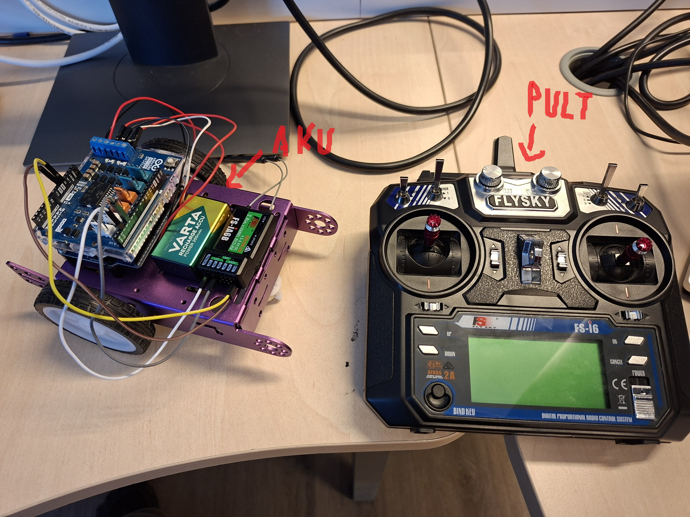
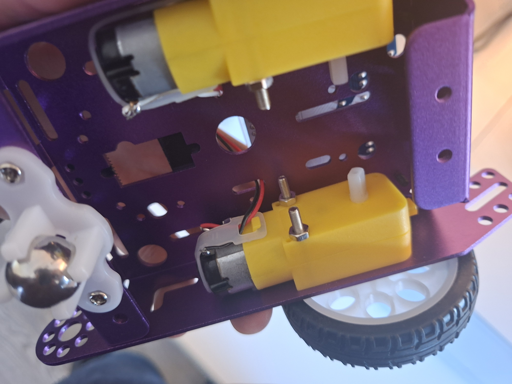
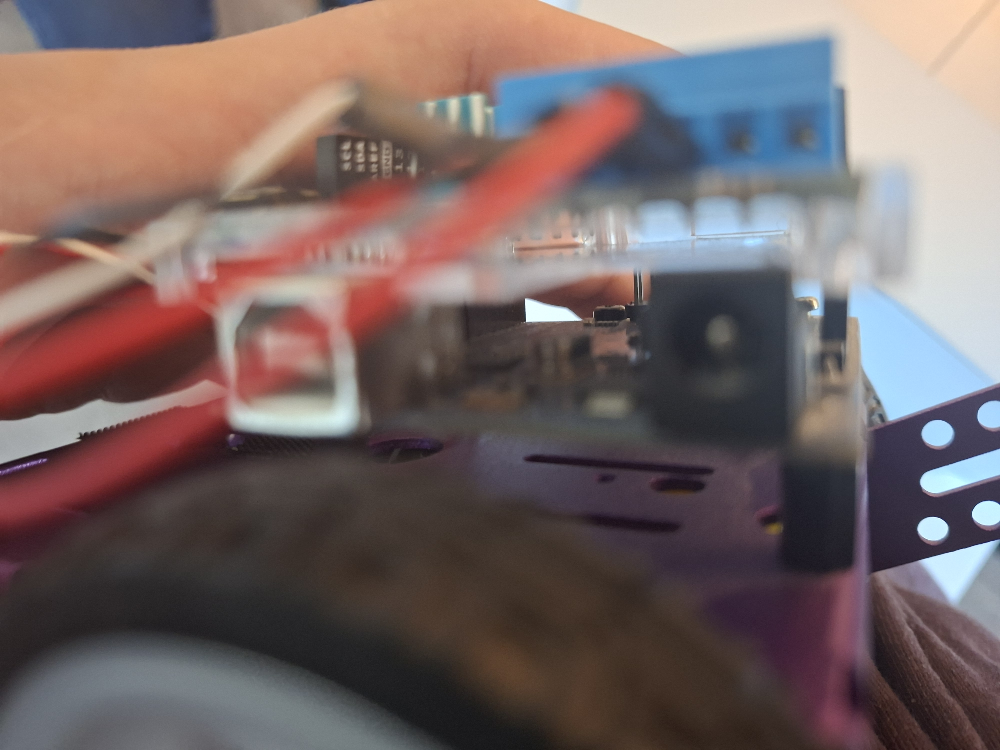
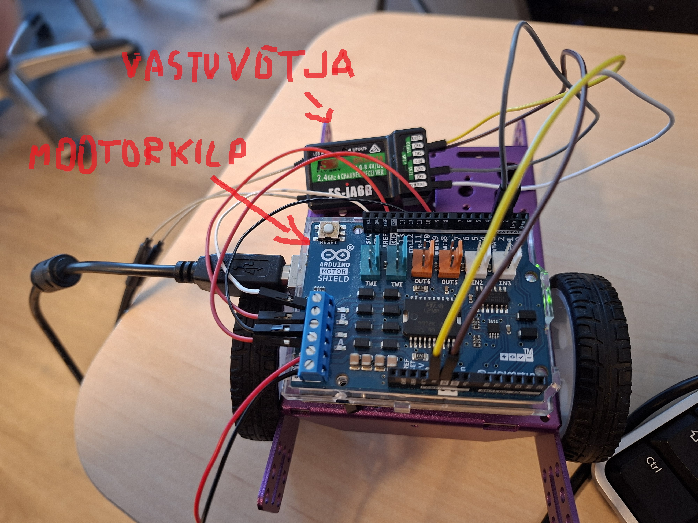

# Kaugjuhitav robot

## Ülesanne

Selle töö eesmärk oli teha kaugjuhitav robot.  
Valisin puldiga juhitava roboti, kuna see tundus kõige lihtsam lahendus ja oli hea viis õppida, kuidas Arduino, mootorid ja raadiosaatja koos töötavad. :contentReference[oaicite:2]{index=2}

---

## Kasutatud vahendid

Robotis kasutasin järgmisi komponente:

- **Arduino mikrokontroller** – roboti aju
- **Arduino mootorikilp** – võimaldab mootoreid juhtida
- **2 mootorit** – panevad rattad liikuma
- **Pult ja vastuvõtja** – roboti kaugjuhtimiseks
- **Aku** – annab robotile voolu :contentReference[oaicite:3]{index=3}

---

## Pildid

### Skeem ja kasutatud osad

### Valmis robot ja pult

### Mootorite paigaldus

### Roboti külgvaade

### Ühendused roboti peal

---

## Ühendamine

- Ühendasin Arduino ja mootorid nii, et need oleks ühendatud mootorikilbiga.
- Mootorid ühendasin mootorikilbi külge, sest mootorikilp võimaldab mootoreid kontrollida.
- Vastuvõtja ühendasin Arduino külge.
- Toite ühendasin nii, et see oleks ühendatud mootorikilbiga. :contentReference[oaicite:4]{index=4}

---

## Kuidas robot töötab

- Puldi vasaku kangiga saab muuta kiirust ning edasi-tagasi liikumise suunda.
- Parema kangiga saab robotit pöörata.
- Arduino saab vastuvõtjalt signaali ja saadab selle edasi mootorikilbile.
- Mootorikilp paneb mootorid liikuma vastavalt sellele, kuidas pulti kasutada. :contentReference[oaicite:5]{index=5}

---

## Probleemid ja lahendused

### 1. Vastuvõtja ei töötanud
Alguses ei töötanud vastuvõtja õigesti.  
Lahenduseks ühendasin puldi ära ja kontrollisin ühendused üle. :contentReference[oaicite:6]{index=6}

### 2. Vasak mootor ei töötanud
Alguses ei töötanud vasak mootor.  
Hiljem sain aru, et USB-kaabel ei andnud piisavalt voolu. Kui kasutasin akut, hakkasid mõlemad mootorid tööle. :contentReference[oaicite:7]{index=7}

---

## Mida õppisin

Selle töö käigus õppisin:

- kuidas ühendada raadiosaatjat
- et see projekt ei ole nii lihtne nagu Lego
- praktiliselt, kuidas erinevad komponendid koos töötavad

Järgmisel korral teeksin võib-olla drooni. :contentReference[oaicite:8]{index=8}

---

## Kokkuvõte

Minu eesmärk sai täidetud, sest robot töötas.  
Olen oma tööga rahul, kuna sain roboti liikuma ja tööle. :contentReference[oaicite:9]{index=9}

---

## Video

[Töötava roboti video](https://youtube.com/shorts/gkEYj67SPFk?feature=share) :contentReference[oaicite:10]{index=10}

---

## Kood

[Töötav kood GitHubis](https://github.com/Supipoisid84/robot/blob/main/sketch_apr7a.ino) :contentReference[oaicite:11]{index=11}
